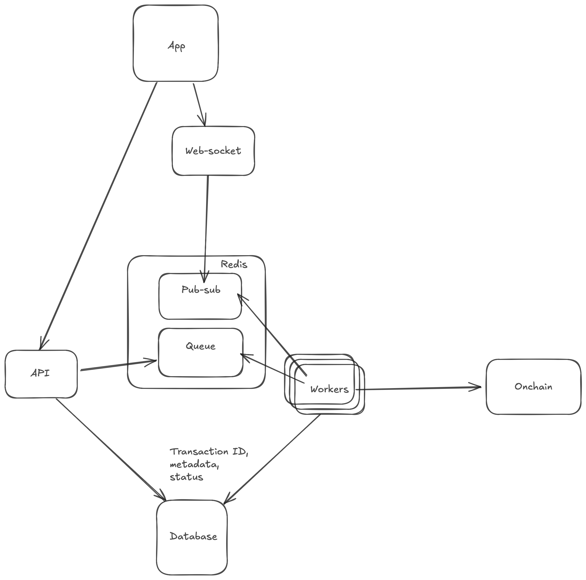

# Reya Workers - DEX Transaction Processing System

A TypeScript-based system for processing DEX trading events using a distributed architecture with Redis queues and PostgreSQL for persistence.

## Architecture Overview



The system consists of the following components:

1. **API Server**: Receives trade requests and adds them to a Redis queue
2. **Redis Queue**: Manages the transaction processing queue using BullMQ
3. **Worker Service**: Processes queued transactions asynchronously
4. **PostgreSQL Database**: Stores transaction state and history

## System Flow

1. Client submits a trade via the API
2. API creates a transaction record in PostgreSQL with 'PENDING' status
3. API adds the transaction to the Redis queue
4. Worker picks up the transaction from the queue
5. Worker updates transaction status to 'PROCESSING'
6. Worker sends the transaction to the blockchain
7. Worker updates transaction status to 'COMPLETED' or 'FAILED'

## Setup and Installation

### Prerequisites

- Node.js v16+
- Redis server
- PostgreSQL database

### Environment Variables

Create a `.env` file in the project root with the following variables:

```
REDIS_HOST=localhost
REDIS_PORT=6379
DATABASE_URL=postgresql://localhost:5432/reya_dex
RPC_URL=your_blockchain_rpc_url
PRIVATE_KEY=your_private_key_with_0x_prefix
PORT=3000
```

### Installation

```bash
# Install dependencies
npm install

# Initialize the database
npm run init-db

# Build the project
npm run build
```

## Running the System

### Start the API Server

```bash
npm run start:api
```

### Start the Worker Service

```bash
export PRIVATE_KEY=0xyour_private_key_here
npm run start:worker
```

## API Endpoints

### Submit a Trade

```
POST /trade
```

Request body:
```json
{
  "to": "0x742d35Cc6634C0532925a3b844Bc454e4438f44e",
  "data": "0x23b872dd000000000000000000000000742d35cc6634c0532925a3b844bc454e4438f44e",
  "amount": "0.01",  // optional
  "gasLimit": "300000"  // optional
}
```

Response:
```json
{
  "success": true,
  "txId": "6f072123-7ef7-4fc1-861e-790490bbbfb7",
  "jobId": "1",
  "message": "Trade submitted successfully"
}
```

### Check Transaction Status

```
GET /trade/:txId
```

Response:
```json
{
  "success": true,
  "transaction": {
    "status": "COMPLETED",
    "tx_hash": "0x...",
    "created_at": "2025-04-04T10:15:30.123Z",
    "updated_at": "2025-04-04T10:16:02.456Z"
  }
}
```

### Monitor Queue Status

```
GET /monitor
```

Response:
```json
{
  "success": true,
  "metrics": {
    "counts": {
      "waiting": 0,
      "active": 1,
      "completed": 5,
      "failed": 0
    },
    "jobs": {
      "waiting": [],
      "active": [{
        "id": "2",
        "timestamp": 1712221530123,
        "data": {
          "txId": "...",
          "to": "0x...",
          "data": "0x..."
        }
      }],
      "completed": [...],
      "failed": []
    }
  }
}
```

## Monitoring Redis

### Using Redis CLI

```bash
# Connect to Redis
redis-cli

# List all queue keys
KEYS trade-queue:*

# Get job counts
LLEN trade-queue:waiting
LLEN trade-queue:active
LLEN trade-queue:completed
LLEN trade-queue:failed

# Monitor all Redis commands in real-time
MONITOR
```

### Using the Worker Logs

The worker logs detailed information about job processing:
- Job start events
- Job completion with transaction hashes
- Job failures with error details
- Queue metrics every 30 seconds

## Development

### Development Scripts

```bash
# Run API in development mode
npm run dev:api

# Run worker in development mode
npm run dev:worker

# Check Redis connectivity
npm run check-redis
```

## Troubleshooting

### Redis Connection Issues

- Ensure Redis is running: `redis-cli ping` should return "PONG"
- Check Redis connection settings in the `.env` file
- Run the Redis check script: `npm run check-redis`

### Database Issues

- Ensure PostgreSQL is running
- Verify the database exists: `psql -l`
- Check database connection string in the `.env` file
- Run the database initialization script: `npm run init-db`
